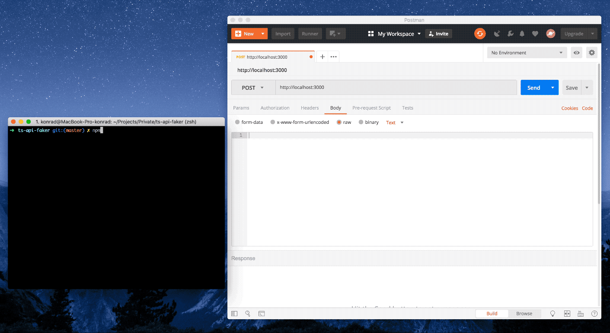

## What is it?

Minimal fake API server based on faker.js and unsplash.com

## Why should you use it?

To fake backend before its made and start frontend development just after project planning.

## How it works?



## How to use it?

After making post request with json argument

```json
[
  {
    "fields": {
      "name": {
        "fake": "name.firstName"
      },
      "surname": {
        "fake": "name.lastName"
      },
      "mail": {
        "fake": "internet.email"
      },
      "profilePhoto": {
        "fake": "internet.avatar"
      },
      "animalPhoto": {
        "fake": "image.cat"
      }
    }
  },
  {
    "fields": {
      "name": {
        "fake": "name.firstName"
      },
      "surname": {
        "fake": "name.lastName"
      },
      "mail": {
        "fake": "internet.email"
      },
      "profilePhoto": {
        "fake": "internet.avatar"
      },
      "animalPhoto": {
        "fake": "image.dog"
      }
    }
  }
]
```

it returns

```json
[
  {
    "animalPhoto": "https://source.unsplash.com/200x200/?cat",
    "profilePhoto": "https://s3.amazonaws.com/uifaces/faces/twitter/gu5taf/128.jpg",
    "mail": "Bernhard_Bradtke@hotmail.com",
    "surname": "Schaefer",
    "name": "Madelynn"
  },
  {
    "animalPhoto": "https://source.unsplash.com/200x200/?dog",
    "profilePhoto": "https://s3.amazonaws.com/uifaces/faces/twitter/Elt_n/128.jpg",
    "mail": "Eula_Spencer24@gmail.com",
    "surname": "Herzog",
    "name": "Lempi"
  }
]
```

Ant these 2 photos looks like


### Some examples of arguments to JSON

| Key                 |            Result           |
| ---                 |             :---:           |
| address.zipCode     | 73318                       |
| commerce.department | Toys                        |
| company.companyName | Grant Group                 |
| database.type       | text                        |
| date.future         | 2016-12-12T14:50:49.361Z    |
| lorem.words         | itaque nostrum molestiae    |

Learn more about arguments that can be passed in JSON in [Faker.js Repo](https://github.com/marak/Faker.js/).

## Installation

Clone this repo and run

```
npm install
npm run build
```

## Run development server

```
npm run dev
```

## Run production server

```
npm run start
```

or using docker image

```
docker run -d -p 3000:3000 slothking/ts-api-faker
```

## Build

```
npm run build
```


## Contribute

Feel free to contact us and contribute. aexol@aexol.com

1.  fork this repo
2.  Create your feature branch: git checkout -b feature-name
3.  Commit your changes: git commit -am 'Add some feature'
4.  Push to the branch: git push origin my-new-feature
5.  Submit a pull request

